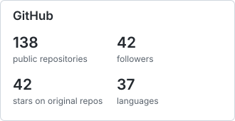
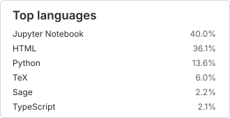

<h1 align="center">Hi! I'm Zack 👋</h1>

<h2 align="center">Postdoctoral researcher at NCTS in Taipei, working on compactifications of moduli spaces of complex algebraic surfaces.</h2>

  
  &nbsp;&nbsp;
  
  &nbsp;&nbsp;
  

 

## Projects

### SageMath

Sage builds its class hierarchy at runtime, so ordinary Python tooling cannot see it. These three make it visible.

| Repository | What it does for you |
| --- | --- |
| sagemath-mypy-plugin  | Makes `@override`, `@final`, abstract-method and signature checks work on Sage category classes, whose MRO exists only at runtime. Without it every `@override` on a provider method is reported as an error. |
| sage-stubs  | Type stubs for the Sage 10.7 category and structure surface, so mypy can analyze code importing `sage.categories.*`, `sage.structure.*`, and `sage.misc.*`. Discovered automatically; no `mypy_path` setup. |
| sage-lsp-server  | Completion, hover, and signature help for `sage.all` names in JupyterLab or any LSP editor, so Sage cells stop looking like undefined identifiers. |

### Lean 4

| Repository | What it does for you |
| --- | --- |
| formalization-corpus  · Search it  | One query across the formal literature: Mathlib, the Fermat's Last Theorem and Carleson's theorem projects, Viazovska's sphere packing, the Polynomial Freiman–Ruzsa conjecture, condensed mathematics — and, in Rocq and Agda, Feit–Thompson and the univalent libraries. Answers "has anyone formalized this, and where", before you start proving it yourself. Open JSON API. |
| lean-jupyter-kernel  | Runs Lean 4 in a notebook where a cell's output always matches the source visible above it. Editing an early cell re-runs what depends on it instead of leaving stale results from a version that is no longer on screen. |
| lean-categories  · Browse corpus  | The arithmetic theory of quadratic and bilinear lattices in Lean 4, which Mathlib does not cover: Jordan splitting over discrete valuation rings, discriminant forms and gluing, genus and spinor-genus invariants, Hasse and Witt invariants, and the mass of a genus. Nothing is admitted: no `sorry`. The site reads the other way round: it takes the standard graduate texts — Dummit and Foote, Riehl, Atiyah–Macdonald, Weibel, Hartshorne, Matsumura and the rest — and says, definition by definition and theorem by theorem, which ones Lean already has and which are still unformalized. |

### Writing and documents

| Repository | What it does for you |
| --- | --- |
| pandoc-preview  | A local Overleaf substitute for people who already have a real pandoc setup. Markdown, LaTeX, TikZ, BibTeX, Beamer and reveal.js in one editor; every renderer and exporter is a command you configure, not a fixed menu of app features. |
| pandoc-ssg  | Publishes a Markdown site with real LaTeX math and `tikzcd`/TikZ blocks compiled to inline SVG, using your own pandoc templates, filters and macros rather than a generator's dialect of Markdown. |
| zotero-local-write-api  | Zotero's built-in local API is read-only. This add-on adds write endpoints — items, notes, attachments, collections, tags — on the same localhost server, with no API key and no cloud round trip. |

### LLM and agent infrastructure

| Repository | What it does for you |
| --- | --- |
| usage-limits  | Shows how much quota you have left across every provider at once: Claude Code, Codex, Copilot, Cursor, Antigravity, DeepSeek, Kiro, Ollama Cloud. |
| improved-webtools  | Gives an agent web search and page fetching through your own SearxNG instance — no API key, no per-query billing. Works as an OpenCode plugin or as an MCP server for any client. |
| itree  | Keeps a repository's GitHub sub-issue tree ordered and answers one question — what is the single next work unit — while flagging cycles, orphaned issues, and work hidden outside the tree. |
| agent-memory  | Lets an agent keep and search notes across sessions, stored as plain Markdown in a git-tracked vault you can read and edit yourself. |
| ai-review-ci  | Installs the same commit, push, and CI quality gates into any repository with one command, including hooks and branch protection. Profiles for Python, Bun, Rust, Sage, and docs. |

### Forks that add something

| Repository | What it adds over upstream |
| --- | --- |
| zettlr-pandoc  · Zettlr  | Zettlr rendering math with MathJax instead of KaTeX, including mhchem, plus your own TeX macros defined once and honored both in the editor and in every pandoc export. |
| jupyter-mcp-server  · Docs  | Drives Jupyter notebooks over ordinary HTTP with an OpenAPI schema instead of MCP. Notebooks are addressed by an ID derived from their path, so there is no session state to lose across restarts, and GPT Actions can call it directly. |

 

  

